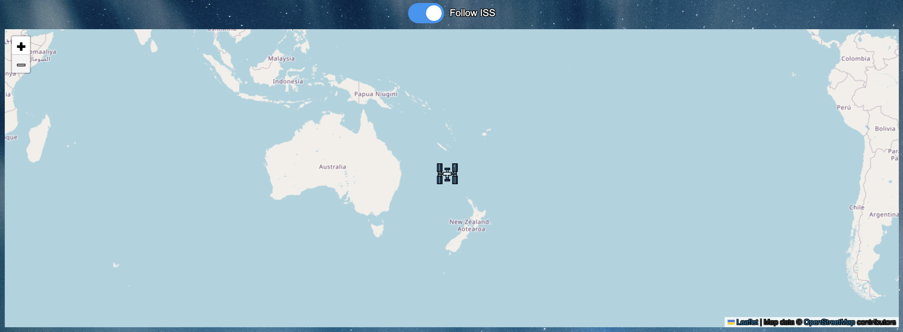

# ISS Location Tracker

[Check out the live site here on Netlify!](https://isslocationtracker.netlify.app)

[Check out the live site here on Github pages!](https://m311han.github.io/iss-location-tracker/)


The ISS Location Tracker is a web application that tracks the current location of the International Space Station (ISS) and displays it on a map. The application provides real-time updates of the ISS's latitude, longitude, and timestamp, and allows users to follow the iss satellite on a live map while being able to adjust the update interval.

The default update interval is set to 5 seconds, which is a balanced choice for tracking the ISS. It is frequent enough to provide reasonably current data without being overly demanding on resources. While updating every second might offer more real-time data, it could be overkill and place unnecessary load on the server. By providing an option for users to customize the interval time, the application caters to varying needs and preferences. Additionally, users can toggle the "Follow ISS" feature to automatically pan the map to the ISS's position.

How the map looks like in the browser interface, providing the user an option for tracking:


## Table of Contents

- [Containerization](#Containerization)
- [Features](#features)
- [Technologies Used](#technologies-used)
- [Setup and Installation](#setup-and-installation)
- [File Structure](#file-structure)
- [Usage](#usage)
- [Code Overview](#code-overview)
  - [HTML](#html)
  - [JavaScript](#javascript)
  - [CSS](#css)
- [Error Handling and UI Feedback](#error-handling-and-ui-feedback)
- [Deployment and Live Server Issues](#deployment-and-live-server-issues)
- [Contributing](#contributing)
- [License](#license)

## Containerization

This project is containerized using Docker, allowing it to run on any machine with Docker installed. Follow the steps below to pull the container image, run it, stop it, and start it again.

### Pull and Run the Docker Container

**1. Install Docker:**
   If you haven't installed Docker yet, download it from Docker's [official website.](https://www.docker.com)

**2. Pull the Docker Image:**
   You can pull the pre-built Docker image from Docker Hub using the following command:

```bash
docker pull melihhan/iss-tracker
```

**3. Run the Container:**
   After pulling the image, you can run the container by mapping port 8080 on your local machine to port 80 in the container:

```bash
docker run -d -p 8080:80 melihhan/iss-tracker
```

The application will now be accessible at `http://localhost:8080` in your web browser.

### Stopping and Restarting the Docker Container

**1. Stop the Running Container:**
   To stop the container, first list all running containers to find the container ID:

```bash
docker ps
```

Then, stop the container using the container ID:

```bash
docker stop <container_id>
```

**2. Restart the Stopped Container:**
   If the container has been stopped, you can start it again without having to pull the image again:

```bash
docker start <container_id>
```

### Removing the Docker Container and Image (Optional)

**1. Remove the Stopped Container:**
   If you no longer need the container, you can remove it:

```bash
docker rm <container_id>
```

**2. Remove the Docker Image:**
   To free up space, you can also remove the Docker image from your local machine:

```bash
docker rmi melihhan/iss-tracker
```

### Note:
You can always pull the image again from Docker Hub later if needed by running the following:

```bash
# Pull the image from Docker Hub (if it’s no longer on your local machine):
docker pull melihhan/iss-tracker

# Run the container (after pulling or if the image is still on Docker Hub):
docker run -d -p 8080:80 melihhan/iss-tracker
```

## Features

- Real-time tracking of the ISS location.
- Adjustable update intervals (1 second, 5 seconds, 10 seconds, 30 seconds).
- Displays the ISS's latitude, longitude, and timestamp.
- Converts timestamp to a readable date and time.
- "Follow ISS" feature to automatically pan the map to the ISS's position.
- Interactive map using Leaflet.js.

## Technologies Used

- HTML
- CSS
- JavaScript
- Leaflet.js
- Open Notify API

## Setup and Installation

```bash
# Clone the repository:
git clone https://github.com/your-username/iss-location-tracker.git

# Navigate into the cloned directory with:
cd iss-location-tracker

# Open the project in your favorite code editor.

# Open index.html in your web browser to view the application.
# This can be done by right clicking on the index.html file and selecting "open with live server".
```

## File Structure

- index.html: The main HTML file containing the structure of the web application.
- css/styles.css: The CSS file for styling the web application.
- js/script.js: The JavaScript file containing the logic for fetching ISS location data and updating the map.
- images: this directory holds all the images for the site

## Usage

- View ISS Location: Open the application to see the current location of the ISS on the map.
- Adjust Update Interval: Use the dropdown menu to select how often the ISS data should be refreshed.
- Follow ISS: Toggle the switch to enable or disable the automatic panning of the map to follow the ISS's position.

## Code Overview

## HTML

The index.html file sets up the structure of the web application, including:

- Header and title.
- Dropdown menu for selecting the update interval.
- Sections for displaying the ISS's latitude, longitude, timestamp, and readable date & time.
- A switch for toggling the "Follow ISS" feature.
- A container for the Leaflet map.

## JavaScript

The js/script.js file contains the logic for:

- Fetching ISS location data from the Open Notify API.
- Updating the HTML elements with the fetched data.
- Handling errors and displaying appropriate messages.
- Managing the update interval and "Follow ISS" feature.
- Initializing and updating the Leaflet map.

## CSS

- The css/styles.css file styles the web application, including the layout, typography, and custom switch for the "Follow ISS" feature.

## Error Handling and UI Feedback

- If the data cannot be fetched or the API is down, the UI will display "Data unavailable" messages.
- If the fetch operation takes longer than 500ms, a loading message will be displayed to indicate that the data is being fetched.

## Deployment and Live Server Issues

### Issue Description

Due to security policies in modern web browsers, the live version of this ISS Tracker may not display data as expected when hosted on platforms enforcing HTTPS, such as GitHub Pages. This is primarily due to the external ISS tracking API (`http://api.open-notify.org/iss-now.json`) being served over HTTP and not supporting CORS (Cross-Origin Resource Sharing), which is required for cross-domain requests in web applications.

### Running Locally

To experience the full functionality of this application, you are encouraged to run it locally. Here are the steps:

1. Clone the repository to your local machine.
2. Open the project in a web browser directly from the file system, or serve it using a simple HTTP server.

### Possible Solutions

- **Proxy Server**: Setting up a proxy server to handle API requests can mitigate the issue. This server would fetch data from the ISS API and forward it to the frontend over HTTPS.
- **API Alternatives**: Utilizing an alternative API that supports HTTPS and proper CORS settings could also resolve the problem.

### Future Enhancements

I am exploring solutions like implementing a backend proxy to handle data fetching securely and reliably. Updates will be documented in this project's progress.

## Contributing

Contributions are welcome! Please fork the repository and submit a pull request for any enhancements or bug fixes.

## License

This project was created by Melihhan (https://github.com/M311HAN). [Visit the repository](https://github.com/M311HAN?tab=repositories) for more projects and further collaboration.
